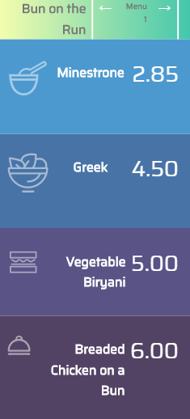

# Assignment 3

## Purpose

This vanilla JavaScript web app displays various daily menus which can be viewed by clicking either the next or previous buttons.  



## Concepts Learned

To create this "Bun on the Run" menu app the following JavaScript concepts were used:
- variables let vs const
- spread operator
- async function
- document.querySelector
- manipulate arrays with push
- comparison with strict equality operator
- use conditional logic with if statements
- reuseable javascript using functions

## How I made the web app

1. First I defined a const called menus and assigned it to be an empty array
    ```js
    const menus = []
    ```
    The reason why I did that is because the menus array will eventually be assigned an array of objects where each object represents a daily menu, complete with menu items and prices.

1. Next I defined a variable called page and initialised it's value as 0
    ```js
    let page = 0;
    ```
    The reason why I did that is because it's value is eventually going to change.
    If i would have defined it as const then i would not be able to change the value of page.
    

1. Next I defined a const called menuTitle and targeted it using document.querySelector
    ```js
    const menuTitle = document.querySelector("#menutitle");
    ```
    The reason why I did that because i had to change the menu title 

1. Next I defined a function called display which take in a parameter called menu1
    ```js
    function display(menu1) {
        menuTitle.textContent = menus[page].title;
        soup.textContent = menus[page].soup;
        soupPrice.textContent = menus[page].soupPrice;
        ...etc...
    }
    ```
    This function displays the current menu.  For exammple, it displays the menu title by using the value of page variable.

1. Next I defined a function called jsonf which will fetch our menus data in JSON format
    ```js
    async function getMenus() {
    const jsonf = await fetch(
      "https://gist.githubusercontent.com/avcoder/0de79329fdfec90a62e968a43865fc04/raw/4de44757059396a0fb66789b8223ae33a1109fa8/menu.json"
    );
    const data = await jsonf.json();
    menus.push(...data);
    display();
  }
  
    ```
    First I defined a constant called jsonf which will be assigned the the link to our json data.
    
    Next I defined a const called data which is assigned the json data

    Next I inserted that entire array of objects into our menus array by using spread operator  

    Next I called the function display to display our current menu passing in the argument of our first menu in our array

1.  Next I defined a function called previous which takes no parameter but decrements our currentIndex by 1 then calls our display function
    ```js
    function previous()
      {
        if (page === 0){
          page = 4;
        }
        else {
          page = page - 1;  
        }
        display();
      }
    ```
    The reason I'm manipulating the value of page is that it will prevent the previous function from going out of bounds.

1.  In similar fashion, I also created a function called next with similar logic.
    ```js
    function next()
      {
        if (page === menus.length-1){
          page = 0;
        }
        else {
          page = page + 1;  
        }
        display();
      }
    ```

1.  Next I added some click event listeners to both next and previous buttons
    ```js
    nextBtn.addEventListener("click",next);
    prevBtn.addEventListener("click",previous);
    ```
    The reason for adding click event handlers is so that we can move to next menu as well as previous menu.

1.  Finally, I __________________________
    ```js
    init();
    ```

# Reflection
## What is the hardest part of creating this web app?
- fetching the json data

## What remaining JS concepts are still kind of foggy?
- mutations, modifying Nested Within an Object

## Deck of cards API (remnant of Assignment 4)
Given the documentation listed here: https://deckofcardsapi.com/ it lists 2 APIs/REST endpoints `Shuffle the Cards` and `Draw a card`.  What would you need to do to draw 1 card?
- https://deckofcardsapi.com/api/deck/new/draw/?count=1

